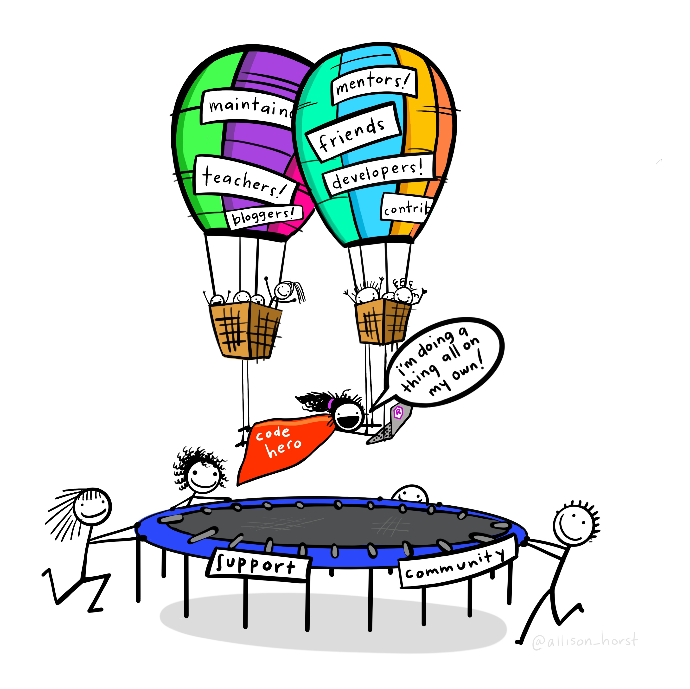
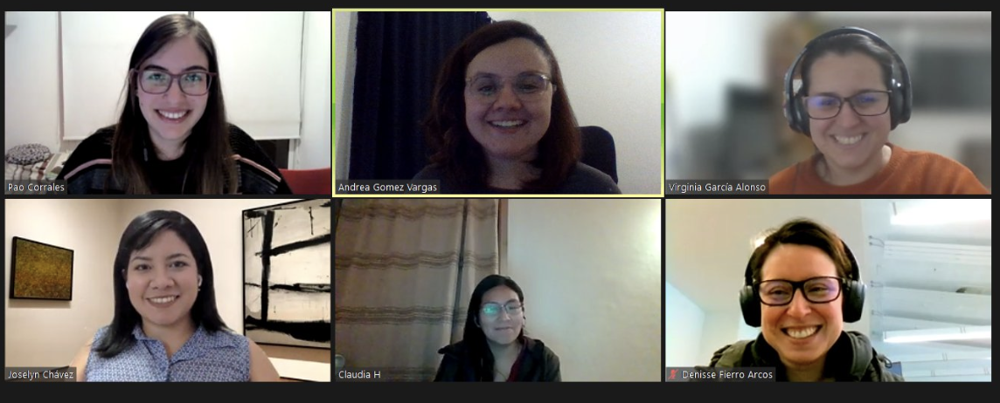

# Overview

- R community

- Our journey towards accessibility

- Where do we begin? 

- Best practices

- Additional references

--

???
Hello everyone, my name is Andrea. I am a sociologist and an organizer of the rladies Buenos Aires chapter. 

On this occasion I will tell you a little about our experience preparing a talk for useR 2021 and the accessibility practices we applied to our presentation, which may be useful to you when preparing a presentation using R. 

This talk will cover 5 topics, first I will discuss where the accessibility initiative was born, second I will talk about how we organized ourselves, third I will discuss how we started our journey towards accessibility and the questions we asked ourselves, then I will show you some best practices that we applied to our work, and finally I will share some useful resources that you can refer to when applying accessibility to your own work. 

---

class: middle, inverse, title-slide

# R Community

???
About the R community


---

```{r, echo=FALSE, fig.alt = "Illustration by Allison horst that shows the importance of community in learning, which is exemplified as a person being supported by their circles of friends, teachers and mentors represented in aerostatic balloons, along with the support and containment of the community represented in the form of a trampoline.  The person is a woman, who is inspired to start doing things on her own with all those around her and accompanying her.", out.width = "65%", fig.align='center'}

```

???

I chose this illustration by Allison Horst for this section because it represents what the R community and rladies in particular mean to me. It shows how the work we did for useR would have not been possible without the support of these communities.
---


# The team: collective and interdisciplinary work

```{r, echo=FALSE, fig.alt = "Picture of the Survey team, with the headshots of Paola, Andrea, Virginia, Joselyn, Claudia and Denisse", out.width = "50%", fig.align='center'}

```

From top left to top right: Paola Corrales (**Atmospheric Scientist**); Andrea Gómez Vargas (**Sociology**); Virginia A. García Alonso (**Marine Biologist**); 


From bottom left to lower right: Joselyn Chávez (**Biotechnology engineer**); Claudia A. Huaylla (**Mathematical Scientist**); Denisse Fierro Arcos (**Marine Scientist**)

???
And here is where I want to introduce you to the team, all of us belong to  4 rladies chapters based in different cities and countries across Latin America, including Mexico, Ecuador, Colombia and Argentina. All our work is done virtually, in a collaborative manner. 

I believe that everything that was achieved would not have been possible without our team members.  I want to emphasize that we all have different areas of training and knowledge of R, which helped to integrate different perspectives and views of reality and consider the different applications of R into our work.


---

class: middle, inverse, title-slide

# Our journey towards accessibility

???

So, how did we create accessible presentations? How was our path to accessibility?

---
<br>

- Understand the needs of latam R users

- Call for collaborators

- Initial survey design (31 questions and 5 areas of interest)

- Reviewed by members of R latam community

- Survey translated (Spanish, Portuguese and English)

- Survey published and advertised

- Presentation of results in useR 2021


???
In 2020 the Latin American survey project began to emerge, we were interested in knowing how widely R was used across our region where English is not the official language. We wanted data, we needed data to better understand Latin American R users. 

In August 2020, a group of about 18 people belonging to R communities in Latin America started to develop a survey to know the people who use R in Latin America, 


The survey was made up of 31 questions that addressed 5 main themes/topics: interest in R, demographic information, education level, relationship with the R user community and the area in which they use R. 

The survey was conducted in three languages: Spanish, Portuguese and English, so that people could answer in the language they felt most comfortable with. The survey was disseminated through all available communication channels, resulting in more than 900 people completing the survey.

And what were we going to do with all that information? 

In 2021, a group of 6 rladies who wanted to take on the challenge of analyzing and presenting the first survey results  got together, and that is how we arrived at useR 2021.


---
# Using R in Latin America: the great, the good, the bad, and the ugly

```{r, echo=FALSE, fig.alt = "Illustrative image of Latin America with the text 'First Latin American survey on the use of R’", out.width = "20%", fig.align='center'}

```

[Slides in English](https://encuesta-user2021-en.netlify.app/#1)        [Slides in Spanish](https://encuesta-user2021-es.netlify.app/#1)         [Youtube Presentation](https://www.youtube.com/watch?v=LyBLJlN6dqo)

???
For useR 2021, we presented our results in a presentation entitled: ‘Using R in Latin America: the great, the good, the bad, and the ugly’. We presented our  work in two languages: English and Spanish, both in the slides and in the video transcript. Our motivation two use both languages was to represent Latin America in the conference and to bring awareness about the participation of other non-English speakers in the R community.

Although data visualization work is done in R, we began to wonder what practices we could implement to make our work more accessible to other users. 


---

class: middle, inverse, title-slide

# Are we inclusive enough?

???
We began to wonder if what we were doing in R was enough to make our results available to as many people as possible.


---

class: middle, inverse, title-slide

# Where do we begin?

???
Where do we start if we never studied accessibility
---
<br>
# Identifying what does accessibility mean 

- the quality of being able to be reached or entered.

- the quality of being easy to obtain or use.

- the quality of being easily understood or appreciated.

???
The first step was to ask ourselves what accessibility means to each one of us, and discuss our different viewpoints. We also looked for open source resources, and with the information we had, we started to find people who could provide more advice about applying these best practices to our work. 


---
class: big-font, middle, inverse, title-slide
<br>
# Accessibility is a RIGHT

???
And here the message I want to give you is that we should think of accessibility as a right, an indispensable human right for the development of a dignified life for people with disabilities, with any type of disability, mild or major, every action we promote and carry out makes us part of this guarantee of rights. For us, it may represent a few more minutes of extra work or training, but for the person benefiting from these actions, it may mean complete access to information they  could not access previously. 

---
<br>
# Accessibility basics

- **see** well or at all,

- **hear** well or at all,

- **move** well or at all,

- **speak** well or at all, or

- **understand** information presented in some ways well or at all

???
So, what's the first thing to keep in mind?

Be open to diversity in your audience and any accessibility issues. Basically, be aware that some of your audience might not be able to or have difficulties with:
Distinguishing colors
Reading text in small font or with poor contrast against its background
Hearing you or understanding when you speak at a fast pace
Poor internet connection 


---
class: middle, inverse, title-slide

# Best practices for accessible conferences

???
And here I want to share some simple practices that you can implement in your work, regardless of what software or programming language you use. 


---

# Accessible presentations 

- Give priority to screen-reader friendly formats 
    - R Markdown (.Rmd) 
    - Xaringan
    
- Avoid using PDF

- Use a readable font and font size.
    - Arial or any Sans serif typeface
    - At least a 28 point size

???
Some good first steps that you can take towards accessibility include:
1. Use file formats that are screen reader friendly. In R, you could use rmarkdown and xaringan to prepare your slides. This will allow people with visual disabilities to truly access all information included in your presentation through their screen reader. Remember to add an alternative text to all your text and tables to maximize data access. 
2. Avoid using PDF format because most screen readers do not work well with it. Often alternative text is lost in this format.
3. Not all fonts are made equal. Fonts like Arial and any in the Sans serif family are best to improve readability. Larger font size is better, for presentations try using font size number 28 or larger.


---
# Accessible presentations
- Alt-text.
  - Briefly explaining what you are showing and why.
  - Describe your images during the presentation.

- Colorblind-friendly palettes (viridis, MetBrewer, colorblindr).

```{r, echo=FALSE, fig.alt = "Two ggplot panels, comparing deafult ggplot2 colors versus the ggplot2 result using viridis color palette, Each panel shows three superposed color-filled   histograms. The default scale uses the colors salmon, light green and light blue, but viridis scale uses purple,aquamarine and yellow, which gives a better contrast.", out.width = "95%", fig.align='center'}
knitr::include_graphics("fig/ggplot.png")
```

???
I mentioned alternative text in the previous slide, you may be wondering what exactly I mean by this. Alternative text, also simply known as alt-text, is a written description of any figures or photos in a presentation. Alt-text is becoming more mainstream and it is now available in many social media platforms, websites, and software used to prepare presentations, including rmarkdown, xaringan and even powerpoint.

Before adding the alt-text to a figure, we should not only aim to include a description of the image, but also how it is related to our presentation. Providing some context to the image is key when preparing alt-text. It is always useful first mentioning the type of graph or image presented, what kind of information is included in each of the axis in case of graphs, and whether information is grouped according to a secondary category shown in different colors

Another thing to consider for images, especially graphs presenting results is the colour palette being used. We should consider that close to 10% of the world population are affected by some sort of colour blindness, which makes it difficult for them to differentiate some colours.

When deciding what palette to use, consider the palettes/packages: viridis, metbrewer, colorblindr, which make great colour blind friendly palettes easy to use in your graphs.

The image in this slide gives you an example of what a colour palette looks like to people with different types of colour blindness. The palette shown is viridis, which allows different colours to be easily identifiable across the colour blindness spectrum, and even better, you can identify different colours in gray scale.

---
class: middle, inverse, title-slide

# How can I implement these best practices in R?

???
Well, here I want to show you a little bit where you can add an alternative text, modify font size and include speaker notes using R. 

This is the rmarkdown script I used for this presentation, here you can see that I am using the rladies template that already has accessible colors and fonts incorporated, in the chunks are the alternative texts for each of the images that I used, where it is important to describe the images in a thorough and organized manner, and also in each slide you can add speaker notes. All this together is reflected in an optimal way in html.

---
class: big-font, middle, inverse, title-slide

# Small changes  
# to include more people 

???
And these examples that I have just mentioned are some small actions that only require a few clicks and maybe a little more time and detail, but they will make your presentation more inclusive and guarantee access to information to more people.


---
<br>
# Additional references

- <https://bit.ly/usertheme>
- <https://bit.ly/guideudl>
- <https://bit.ly/userblog>
- <https://bit.ly/guidealttext>
- <https://bit.ly/accessiblepresentation>
- <https://bit.ly/imagecontent>

???
Finally, I want to share with you some online resources where you can read more about the topic and what new accessibility practices we can continue to apply.


---

class: middle, inverse, title-slide

# Thank you from our team!
<br>
<br>
[`r fontawesome::fa("github", a11y = "sem", fill = "#FFFFFF")` GitHub repo Rladies East Lansing](https://github.com/rladies-eastlansing/2022-accessible_dataviz)
[`r fontawesome::fa("twitter", a11y = "sem", fill = "#FFFFFF")` @RLadiesEastLansing](https://twitter.com/RLadiesELansing)

[`r fontawesome::fa("link", a11y = "sem", fill = "#FFFFFF")` rladies.org](https://rladies.org)
[`r fontawesome::fa("twitter", a11y = "sem", fill = "#FFFFFF")` @RLadiesGlobal](https://twitter.com/rladiesglobal)
[`r fontawesome::fa("slack", a11y = "sem", fill = "#FFFFFF")` Join the Slack](https://rladies-community-slack.herokuapp.com/)


???

And thank you very much rladies from east lansing for this invitation and allowing us to share our experience! This presentation was also done as a group. Here are the links where you can find the presentation and learn more about rladies global. And you are all welcome to be part of the change.


